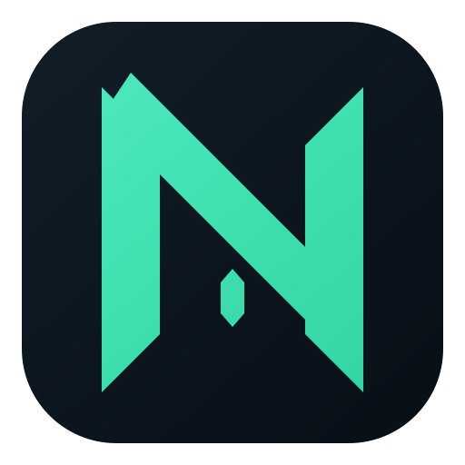

<div align="center">
  
  <h1>Nidalee</h1>
  <p><strong>A lightweight League of Legends desktop assistant built with Tauri, Rust and Vue.</strong></p>

  <p>
    <a href="https://creativecommons.org/licenses/by-nc-sa/4.0/legalcode"></a>
    
    
    
    
  </p>

  <p><a href="README_ZH.md">简体中文</a> · <a href="docs/user-guide-zh.md">User guide</a> · <a href="https://github.com/codexlin/Nidalee/releases">Releases</a></p>
</div>

## What Nidalee provides

- A dashboard for the current account, ranked overview and recent matches.
- Live team analysis driven by League Client and LiveClient data.
- Summoner search and match detail inspection.
- A build center with OP.GG recommendations and personal rune presets.
- Match-ready assistance, champion selection support and rune setup for supported queues.
- A lightweight in-game augment side panel.

The Rust backend owns League Client communication, session state and analysis. The Vue frontend consumes typed commands/events and focuses on interaction and presentation.

## Download

Download the latest Windows installer from [GitHub Releases](https://github.com/codexlin/Nidalee/releases). Windows is the primary supported platform. The release workflow also produces an experimental universal macOS DMG; it is currently not notarized.

Nidalee requests administrator privileges on Windows so it can reliably discover the League Client connection parameters. Windows may show an “unknown publisher” warning because the installer is not Authenticode-signed.

## Development

Requirements:

- Node.js 22.18 or newer
- pnpm 10.34.5
- Rust 1.97.1 (managed through mise)
- Windows WebView2 and the Tauri 2 prerequisites

```bash
git clone git@github.com:codexlin/Nidalee.git
cd Nidalee
pnpm install --frozen-lockfile

# Terminal A: frontend
pnpm dev

# Terminal B: desktop app
pnpm dev:app
```

Useful checks:

```bash
pnpm build
cd src-tauri
cargo test --locked
```

See [the architecture guide](docs/ARCHITECTURE.md), [documentation index](docs/README.md), and [release guide](RELEASE.md).

## Branches and releases

Development uses short-lived `feature/*` and `fixbug/*` branches based on `main`. Changes return to `main` after review and CI. Only a semantic version Tag such as `v1.0.0` triggers a public release. See [RELEASE.md](RELEASE.md) for the complete process.

## License and disclaimer

Nidalee is licensed under [CC BY-NC-SA 4.0](LICENSE). Commercial use is prohibited and derivatives must use the same license. Third-party notices are listed in [THIRD_PARTY_NOTICES.md](THIRD_PARTY_NOTICES.md).

Nidalee is an independent project and is not affiliated with or endorsed by Riot Games or Tencent. It communicates with local League Client APIs and does not inject into, modify, or read game memory. Users remain responsible for complying with applicable game terms and local rules.
